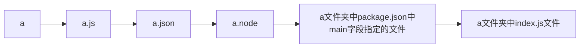

## 使用

package.json 包管理文件

```bash
npm init # 初始化一个包管理文件，可以输入一些配置信息

npm init -y # 初始化一个默认的包管理文件，目录名字不要有中文，不要包含特殊字符

npm init --yes # 和上面等价

npm i moment mime # 安装多个包

# npm i moment mime --save # 和上面等价

# npm i moment mime -S # 和上面等价

npm i # 同事拿到没有 node_modules 的代码后，只需要执行这个命令就能安装所有依赖的包

npm uninstall moment # 卸载包

npm i --production # 只安装生产依赖/项目依赖包

npm i gulp -D # 安装到开发依赖（开发的时候才会用到）

# npm i gulp --save-dev # 和上面等价
```

## 切换源到淘宝镜像

```bash
npm i nrm -g # nrm 是一个源管理工具，-g 代表全局安装

nrm -V # 查看 nrm 是否安装成功

nrm use taobao # 切换 npm 的源（下载地址）到淘宝镜像

nrm ls # 查看处于哪个下载地址

npm i mime # 以后再用 npm 下载包就是从淘宝服务器下载的，就快了
```

## 包的存在形式

项目包：项目需要使用到的（开发依赖包和生产依赖包）

全局包：作为命令行工具存在的

```bash
npm i nrm -g # 安装全局包
npm uninstall nrm -g # 卸载全局包

npm i i5ting_toc -g
i5ting_toc --version
i5ting_toc -f 总结.md -o # 转换 总结.md 为 HTML 文件并自动打开
```

```bash
npm i nodemon -g
nodemon -v

nodemon test.js # 自动监听 test.js 文件的变化，并执行
```

## npm 发布


```bash
1. 注册账号，记得去邮箱里面激活后方能使用

2. 切换本地的源为 npm，`nrm use npm`

3. `npm login`，输入账号和密码

4. `npm publish`，要确保处于包的根目录
```

## 加载规则

1\. 带路径

```js
require('./a');
```




2\. 不带路径

```js
require('mime');
```


## Express

```js
// #1 引入
const express = require('express');

// #2 得到一个服务器对象
const app = express();

// #3 监听 请求地址是 / 的 GET 请求
app.get('/', (req, res) => {
    // send 会根据响应的内容自动设置对应Content-type和编码
    res.send({
        name: 'ifer'
    });
});
app.get('/html', (req, res) => {
    res.send('<h1>h</h1>');
});

// 监听 请求地址是 / 的 POST 请求
app.post('/', (req, res) => {
    res.send('POST 请求');
});

app.get('/news', (req, res) => {
    res.end('news');
});

// #4 设置端口
app.listen(3000, () => console.log('Server running on http://localhost:3000'));
```

```js
// 获取 GET 查询参数
req.query

// 等价于
const url = require('url');
const { query } = url.parse(req.url, true);
```